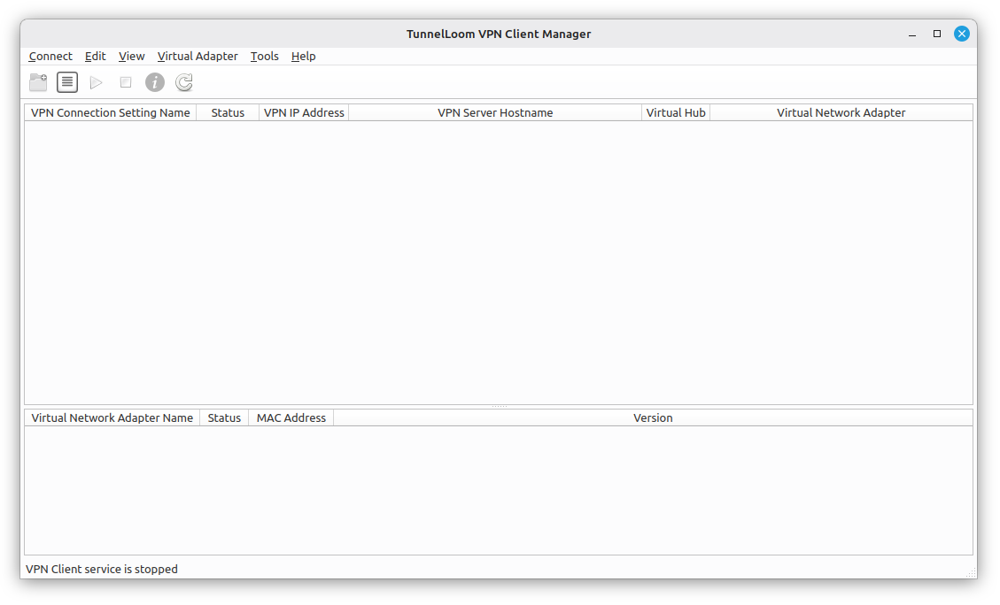

# VPN Client Manager for working with SoftEther on Linux
[](LICENSE)
[](https://www.python.org/)

This was written 100% using ChatGPT.  I have no idea what I am doing.  I was tired of using the CLI to connect to the work VPN.  This tampers with network routing.  Works for me but could trash your network.  Use at your own risk!

## Trademark notice

TunnelLoom is an independent, unofficial project and is not affiliated with,
endorsed by, or sponsored by the SoftEther VPN Project, SoftEther Corporation,
or the University of Tsukuba.

SoftEther and SoftEther VPN are trademarks or product names of their respective
owners. Their names are used only to describe compatibility with this software.

An unofficial graphical manager for the **SoftEther VPN Client on Linux**. It is designed to provide a workflow similar to the Windows SoftEther VPN Client Manager without requiring users to operate `vpncmd` directly.



## Project status

Current version: **0.1.18**

The application was developed and tested on **LMDE 7 / Debian 13 with Cinnamon**. The application code is mostly distribution-independent, but the included installer currently uses `apt` and Debian package names. Other Linux distributions are welcome to adapt the installer and submit improvements.

This project is independent of the SoftEther Project. SoftEther VPN is not bundled and must be installed separately.

## Features

- Displays existing SoftEther connection accounts and virtual adapters
- Creates, edits, deletes, imports, and exports connection settings
- Connects and disconnects VPN accounts
- Creates, enables, disables, deletes, and configures virtual adapters
- Supports standard password, RADIUS/NT-domain, anonymous, and client-certificate authentication
- Supports direct, HTTP proxy, and SOCKS 4 connection modes
- Exposes encryption, compression, certificate verification, retry, startup, TCP, routing, and QoS options
- Uses a native PolicyKit administrator-password prompt
- Keeps one authorized helper active for the GUI session instead of repeatedly asking for a password
- Runs `vpncmd` and `vpnclient` from the directory containing `hamcore.se2`
- Requests IPv4 configuration for SoftEther adapters and performs route/DNS cleanup after disconnect
- Includes network diagnostics and a normal-network repair command
- Loads data at startup, after user actions, or when **Refresh** is clicked; it does not continuously poll
- Provides a Cinnamon-compatible notification-area menu

## Requirements

- Linux desktop with Python 3 and Qt 6/PySide6
- A separately installed SoftEther **VPN Client** for Linux
- `vpnclient`, `vpncmd`, and `hamcore.se2` in the same directory
- PolicyKit with a graphical authentication agent
- NetworkManager, `dhcpcd`, and `iproute2`
- Administrator access during installation and while managing the VPN

A typical SoftEther source installation is located at:

```text
/usr/local/vpnclient
```

That directory should contain:

```text
hamcore.se2
vpnclient
vpncmd
```

## Supported platforms

### Tested

- LMDE 7
- Debian 13 package base
- Cinnamon desktop

### Not yet officially tested

- Debian 12
- Ubuntu and Linux Mint
- Fedora
- Arch Linux and derivatives
- openSUSE
- KDE Plasma and GNOME
- Systems using a resolver/network stack substantially different from NetworkManager

Reports and installer contributions for other distributions are welcome.

## Installation on LMDE 7 / Debian 13

Download or clone the repository, then run the installer as your normal desktop user:

```bash
cd softether-gui-lmde7
./scripts/install.sh
```

Do not run the installer itself as root. It invokes `sudo` only for the steps that require administrator access.

The installer installs these Debian packages:

```text
python3
python3-pyside6.qtcore
python3-pyside6.qtgui
python3-pyside6.qtwidgets
qt6-svg-plugins
polkitd
pkexec
network-manager
dhcpcd-base
iproute2
```

It then installs the application under:

```text
/opt/softether-gui
```

and creates the launcher:

```text
/usr/local/bin/softether-gui
```

## Starting the application

Launch it from the desktop application menu or run:

```bash
softether-gui
```

The PolicyKit administrator-password prompt appears before the manager window. The GUI then queries SoftEther for existing accounts and adapters.

The application can be started from any working directory.

## Diagnostics

Confirm the installed version:

```bash
softether-gui --version
```

Display installation and SoftEther path diagnostics:

```bash
softether-gui --diagnose
```

Test the same `vpncmd` launch path used by the GUI:

```bash
softether-gui --probe-vpncmd
```

Sensitive passwords are not intentionally included in diagnostic output, but review all output before posting it publicly.

## SoftEther program directory

The application searches common locations automatically, including:

```text
/usr/local/vpnclient
/opt/vpnclient
/opt/softether-vpnclient
/usr/lib/softether
~/vpnclient
```

A different location can be selected under **Edit → Preferences**.

SoftEther expects `hamcore.se2` relative to its working directory on Linux. The privileged helper therefore changes into the configured SoftEther directory and invokes:

```text
./vpncmd
./vpnclient
```

The GUI does not change the ownership, permissions, ACLs, or contents of the existing SoftEther installation.

## Basic use

1. Open the GUI and approve the administrator prompt.
2. If the service is stopped, select **Tools → Start VPN Client Service**.
3. Select an existing connection account or create one.
4. Click **Connect**.
5. Wait for the Linux virtual adapter to receive an IPv4 address.
6. Click **Disconnect** before stopping the service.

The GUI obtains account and adapter information from SoftEther itself through `AccountList` and `NicList`. It does not keep a separate database of VPN accounts.

## Linux networking behavior

SoftEther creates an interface named `vpn_<adapter-name>`, such as:

```text
vpn_worknic
```

Linux does not automatically request an IPv4 lease on that interface. After SoftEther reports a successful VPN connection, the GUI runs `dhcpcd` for the VPN interface with its `resolv.conf` hook disabled. This obtains the VPN address and routes without allowing the VPN DHCP process to erase the normal system resolver.

On disconnect, the GUI releases only the VPN adapter lease, removes leftover VPN addresses or routes when necessary, and asks NetworkManager to restore the normal wired or Wi-Fi network state.

Useful commands are available under **Tools**:

- **Network Diagnostics** shows routes, addresses, NetworkManager state, VPN lease information, and resolver contents.
- **Repair Normal Network After VPN** attempts to restore the normal default route and DNS configuration.

## Refresh behavior

The application does not monitor SoftEther every few seconds. It refreshes:

- When the GUI opens
- After a successful user-initiated change
- After starting the service
- When **Refresh** is clicked

Transient empty SoftEther responses do not intentionally erase rows already displayed. When the local VPN Client service is genuinely unavailable, the lists are cleared and the status bar reports that the service is stopped.

## Security design

The GUI itself runs as the desktop user. Root-required operations are handled by a PolicyKit-authorized helper installed at:

```text
/usr/libexec/softether-gui-helper
```

The helper:

- Accepts structured JSON requests through a private pipe
- Validates requested executables and paths
- Requires the SoftEther directory, `vpncmd`, `vpnclient`, and `hamcore.se2` to be root-owned and not group- or world-writable before executing them as root
- Restricts network operations to interfaces beginning with `vpn_`
- Uses root-only temporary files for command input
- Terminates when the GUI exits

Review the helper source before installation if you are uncomfortable authorizing it.

## Running from the source tree

After installing the required dependencies:

```bash
./run-local.sh
```

Root-only SoftEther installations still require the installed PolicyKit helper and policy. Running only the source tree does not bypass normal privilege checks.

## Running tests

Install `pytest`, then run:

```bash
PYTHONPATH=. python3 -m pytest -q
```

On Debian-based systems:

```bash
sudo apt install python3-pytest
```

## Uninstalling

From the source directory:

```bash
./scripts/uninstall.sh
```

Per-user preferences are retained at:

```text
~/.config/softether-gui/config.json
```

Remove that file manually to reset all GUI preferences.

## Reporting problems

When opening an issue, include:

- Linux distribution and version
- Desktop environment
- SoftEther VPN Client version and installation path
- GUI version from `softether-gui --version`
- The exact sequence of actions that caused the problem
- Relevant output from `softether-gui --diagnose`
- Network Diagnostics output when the problem involves routes, DHCP, or DNS

Remove server names, usernames, addresses, certificates, and other private information before posting.

## Contributing

Bug reports, documentation improvements, distribution-specific installers, and code contributions are welcome. Please keep changes narrowly scoped and explain how they were tested.

Especially useful contributions include:

- Fedora/RHEL packaging
- Arch Linux `PKGBUILD`
- openSUSE packaging
- Ubuntu and standard Linux Mint verification
- `systemd-resolved` testing
- KDE and GNOME tray testing

## License

This project is licensed under the **MIT License**. You may use, copy, modify, distribute, sublicense, or sell the software, including for commercial purposes. Copies or substantial portions of the software must retain the copyright and license notice. The software is provided **as is**, without warranty, as stated in the [LICENSE](LICENSE) file.

## Disclaimer and trademarks

This software can start privileged services and change network addresses, routes, and DNS state. Back up important configurations and use it at your own risk.

SoftEther VPN is a separate project and is not included in this repository. “SoftEther” is used only to identify compatibility. This project is not affiliated with, sponsored by, or endorsed by the SoftEther Project or its maintainers.
